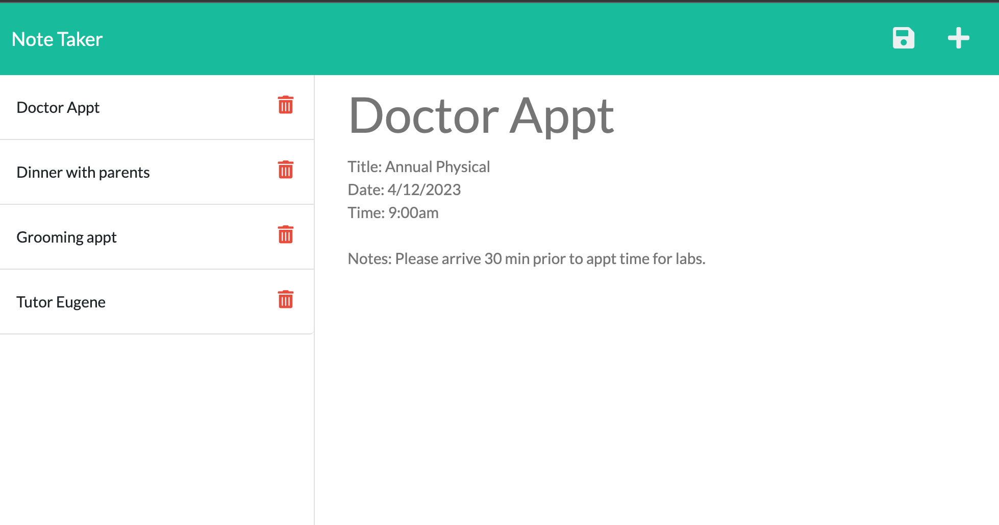

# Note Taker
-------

## Table of Content

- [Description](#description)
- [Image](#image)
- [GitHub Repository](#github-repository)
- [Author](#author)  
- [Contributors](#contributors)
- [Technologies Used](#technologies-used) 
- [License](#license)

-------
## Description:  

The Note Taker (TNT) is an application that can be used to write and save notes. This application uses an Express.js back end and will save and retrieve note data from a JSON file.

-------
## Image:

----
## Github Repository:

- [Github Repository for Note Taker](https://github.com/ksjefferies/note-taker)
- [Heroku Deployment](https://note-taker-2022-3.herokuapp.com/)

## Author:

- [Kelly Jefferies](https://github.com/ksjefferies)

## Contributors

- Eugene Ahn
- Daniel Norred

## Technologies Used:
- Javascript
- HTML / CSS
- Node
- [Express.js](https://expressjs.com/)
- [UUID](https://www.npmjs.com/package/uuid)

## License:

